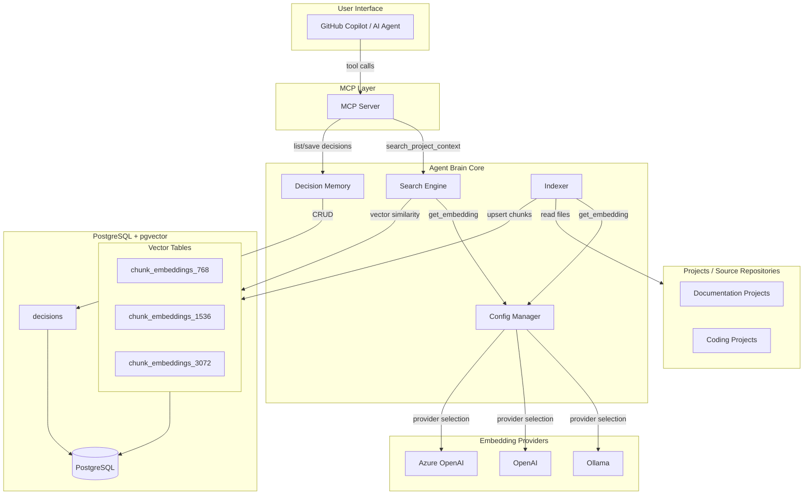
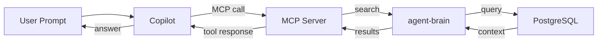

# Architecture Diagrams

## System Architecture

```mermaid
flowchart TB
    subgraph User["User Interface"]
        Copilot["GitHub Copilot / AI Agent"]
    end

    subgraph MCP["MCP Layer"]
        Server["MCP Server"]
    end

    subgraph Core["Agent Brain Core"]
        Search["Search Engine"]
        Decisions["Decision Memory"]
        Indexer["Indexer"]
        Config["Config Manager"]
    end

    subgraph Providers["Embedding Providers"]
        Ollama["Ollama"]
        OpenAI["OpenAI"]
        Azure["Azure OpenAI"]
    end

    subgraph Storage["PostgreSQL + pgvector"]
        DB[(PostgreSQL)]
        subgraph Tables["Vector Tables"]
            V768["chunk_embeddings_768"]
            V1536["chunk_embeddings_1536"]
            V3072["chunk_embeddings_3072"]
        end
        DecTable["decisions"]
    end

    subgraph Projects["Projects / Source Repositories"]
        Docs["Documentation Projects"]
        Code["Coding Projects"]
    end

    %% User flow
    Copilot -->|"tool calls"| Server

    %% MCP to core
    Server -->|"search_project_context"| Search
    Server -->|"list/save decisions"| Decisions

    %% Search flow
    Search -->|"get_embedding"| Config
    Search -->|"vector similarity"| Tables

    %% Config selects provider
    Config -->|"provider selection"| Ollama
    Config -->|"provider selection"| OpenAI
    Config -->|"provider selection"| Azure

    %% Indexer flow
    Indexer -->|"read files"| Projects
    Indexer -->|"get_embedding"| Config
    Indexer -->|"upsert chunks"| Tables

    %% Decision storage
    Decisions -->|"CRUD"| DecTable

    %% Table relationships
    Tables --> DB
    DecTable --> DB
```

## Runtime Request Flow

```mermaid
flowchart LR
    User["User Prompt"] --> Copilot["Copilot"]
    Copilot -->|"MCP call"| MCP["MCP Server"]
    MCP -->|"search"| Brain["agent-brain"]
    Brain -->|"query"| DB["PostgreSQL"]
    DB -->|"context"| Brain
    Brain -->|"results"| MCP
    MCP -->|"tool response"| Copilot
    Copilot -->|"answer"| User
```
